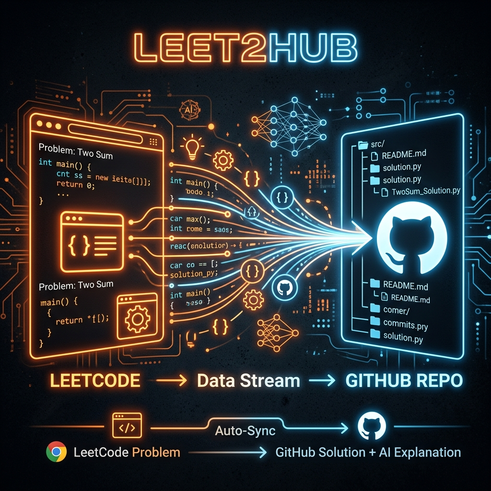
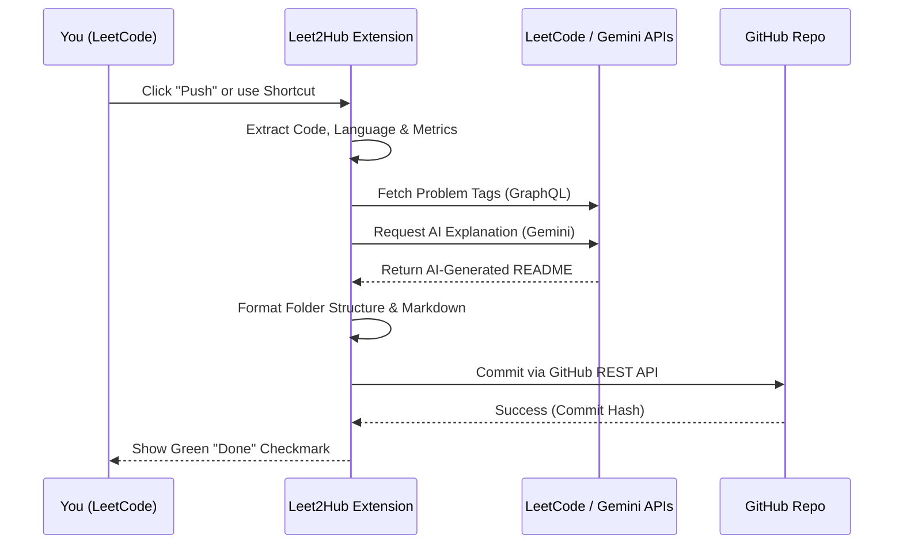
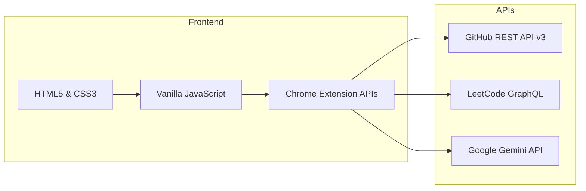

  

<h1 align="center">Leet2Hub 🚀</h1>

  <b>A powerful, AI-integrated Chrome extension to automatically push your LeetCode solutions directly to GitHub with beautifully generated AI READMEs and performance metrics.</b>

  
  
  
  

---

## 🌟 Features

*   **🤖 AI-Generated Solutions:** Powered by the Google Gemini API! Leet2Hub reads your code and automatically generates a pristine Markdown `README.md` containing Intuition, Approaches, and Complexity Analysis for every problem you push.
*   **📂 DSA Folder Auto-Categorization:** Fetches problem tags via LeetCode's GraphQL API and automatically routes your code to specific topic folders (e.g., `01-Arrays-and-Hashing`, `09-Trees`).
*   **📦 Smart Packaging:** Creates a dedicated sub-folder for every problem containing both your source code and your AI-generated explanation.
*   **💅 Glassmorphism UI:** A sleek, modern configuration modal matching LeetCode's native golden-orange (`#ffa116`) aesthetic.
*   **⚡ One-Click Push:** Automatically push your solved problems from LeetCode to GitHub with a single click or keyboard shortcut.
*   **📈 Performance Metrics:** Your GitHub commit messages automatically include LeetCode Time and Memory performance stats (e.g., `[Time Beats: 98%]`).

---

## 🏗️ Architecture Workflow

Here is how Leet2Hub seamlessly integrates LeetCode with your GitHub repository:

---

## 🚀 Installation & Setup

1.  **Clone or Download**: Download this repository to your local machine.
2.  **Load Unpacked Extension**: Open `chrome://extensions/` in Google Chrome, enable **Developer mode** in the top right, and click **Load unpacked**. Select the `Leet2Hub-Extension` folder.
3.  **Configure GitHub**: Pin the extension to your toolbar and open any LeetCode problem. The Leet2Hub configuration modal will pop up.
4.  **Enter Credentials**: 
    *   **GitHub Repository URL**: Link to your target repository.
    *   **Personal Access Token**: A Classic token with `repo` scopes.
5.  **Configure AI (Optional)**: Paste your **Google Gemini API Key** and toggle "Generate AI Explanation" to **yes**.
6.  **Push!**: Solve a problem on LeetCode, wait for the green "Accepted" text, and click the golden **Push** button (or press your configured shortcut).

---

## 🛠️ Tech Stack

---

## 🤝 Contributing
Contributions are always welcome! Feel free to open issues, report bugs, or submit pull requests.

## 📄 License
This project is open-source and licensed under the [MIT License](LICENSE).
