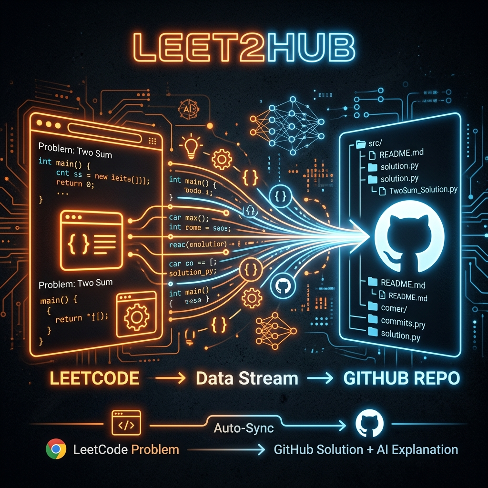

<div align="center">
  
</div>

<h1 align="center">Leet2Hub Chrome Extension 🚀</h1>

<p align="center">
  <b>The core client-side logic, UI injection, and GitHub syncing engine for Leet2Hub.</b>
</p>

---

## Overview

This directory contains the source code for the **Leet2Hub Chrome Extension**. It operates entirely on the client side, meaning there are no intermediate servers handling your code. It reads directly from your browser, generates AI explanations via Google Gemini, and pushes directly to GitHub using their REST API.

## Directory Structure

*   **`manifest.json`**: The core configuration file (Manifest V3) that defines permissions, background workers, and content scripts.
*   **`content-script.js`**: The heavy lifter. Injected into `leetcode.com`, this script bypasses Virtual DOM limitations, reads `__NEXT_DATA__` states, interfaces with the Monaco Editor to grab your exact code, and injects the custom Leet2Hub UI (like the Push button).
*   **`background.js`**: The service worker. It acts as a proxy to bypass strict Content Security Policy (CSP) and CORS restrictions when making `fetch` requests to GitHub and Google Gemini APIs.
*   **`popup/`**: The modern React + Tailwind CSS dashboard. It is bundled via Vite and exported to the `dist/` folder for the extension to consume.
*   **`style.css`**: Global styles injected into the LeetCode DOM for our custom modals and buttons.

## Development & Building

If you want to contribute to the extension or modify the popup UI, you will need to re-compile the React application.

### Prerequisites
*   [Node.js](https://nodejs.org/) (v16+)
*   npm or yarn

### Building the Popup UI
The popup dashboard is a React application built with Vite. The compiled output must be generated before the extension can load it.

```bash
cd popup
npm install
npm run build
```
This will compile the React code and output the raw HTML/JS/CSS into the `dist/` folder at the root of the extension directory.

### Loading the Extension in Chrome
1. Open Google Chrome and navigate to `chrome://extensions/`.
2. Toggle on **Developer mode** in the top right corner.
3. Click **Load unpacked** in the top left.
4. Select the `Leet2Hub-Extension` directory (this folder, which contains the `manifest.json`).
5. Open LeetCode to see the extension in action!

## Architecture Details

*   **State Management**: Extension preferences (GitHub Token, Repo URL, Gemini Key) are stored securely in `chrome.storage.local`. Ephemeral UI states are stored in standard `localStorage`.
*   **AI Integration**: We use the `gemini-1.5-flash` model. The prompt is injected with the raw problem description and your solved source code to generate an algorithmic breakdown.
*   **GitHub API**: Code is committed using a `PUT` request to `https://api.github.com/repos/{owner}/{repo}/contents/{path}`.

---
*For general information about the Leet2Hub ecosystem, please see the [root README](../README.md).*
