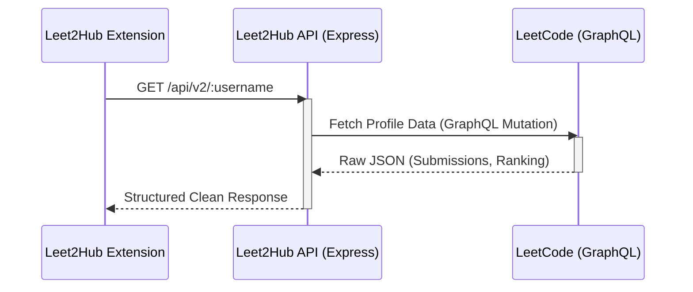

<div align="center">
  <h1>🚀 Leet2Hub API</h1>
  <p><strong>A blazingly fast, modern REST wrapper for LeetCode's GraphQL data.</strong></p>
  
  
  
</div>

---

## 🌟 Overview

The **Leet2Hub API** is a custom backend service engineered exclusively to power the Leet2Hub browser extension. It securely interfaces with LeetCode's internal GraphQL endpoints to extract and normalize data regarding user statistics, daily problems, and submission streaks, converting them into incredibly fast REST responses.

> [!NOTE]
> This API is designed specifically to optimize fetching data required by the popup UI to avoid complex client-side GraphQL mutations and CORS restrictions.

## 📐 Architecture Flow



## ✨ Features

- ⚡ **Fast & Lightweight**: Built with Express and Axios for rapid data delivery.
- 🔒 **CORS Configured**: Ready to securely accept cross-origin requests from your Chrome extension.
- 🛡️ **Type-Safe**: Developed entirely in strict TypeScript for unmatched reliability.
- ☁️ **Deploy-Ready**: Instantly deployable to Vercel, Heroku, or your server of choice.

## 🚀 Getting Started

### Prerequisites
- [Node.js](https://nodejs.org/) (v18 or higher recommended)
- npm, bun, or yarn

### Local Development

1. **Install Dependencies**
   ```bash
   npm install
   ```

2. **Start the Development Server**
   ```bash
   npm run dev
   ```
   *The API will start running locally at `http://localhost:3000`.*

3. **Build for Production**
   ```bash
   npm run build
   ```

## 🔌 API Reference

| Endpoint | Method | Description |
|----------|--------|-------------|
| `/api/v2/:username` | `GET` | Retrieves a user's global statistics, solved counts (Easy/Medium/Hard), and rankings. |
| `/api/v2/userProfileCalendar/:username` | `GET` | Generates a user's activity heatmap and calculates their maximum active streak. |
| `/api/v2/daily` | `GET` | Fetches the current LeetCode Daily Challenge details, difficulty, and topic tags. |

> [!IMPORTANT]  
> All endpoints are prefixed with `/api/v2` in production and return data in a standard `{ data: { ... } }` or JSON format.

## 🌐 Deployment

## 🌐 Deployment

To expose your API so the extension can use it globally, you can host it instantly for free on **Vercel** using Serverless Functions.

### Deploying to Vercel

1. Install the Vercel CLI: 
   ```bash
   npm i -g vercel
   ```
2. Log in and deploy from this directory:
   ```bash
   vercel --prod
   ```

**Important**: Once deployed, update the `BASE_URL` in your extension's frontend code to connect your popup directly to your new live API!

---
<div align="center">
  <p>Built exclusively for Leet2Hub.</p>
</div>
