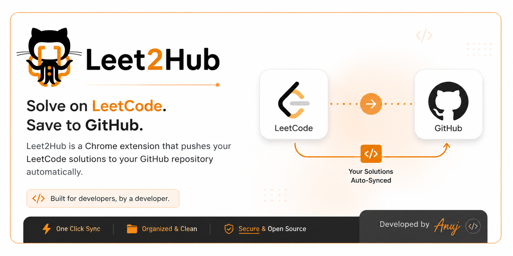
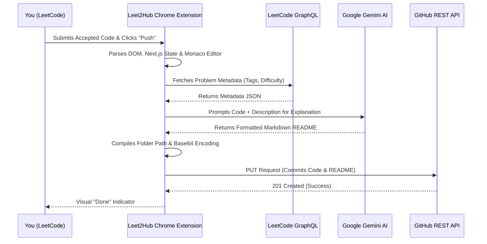
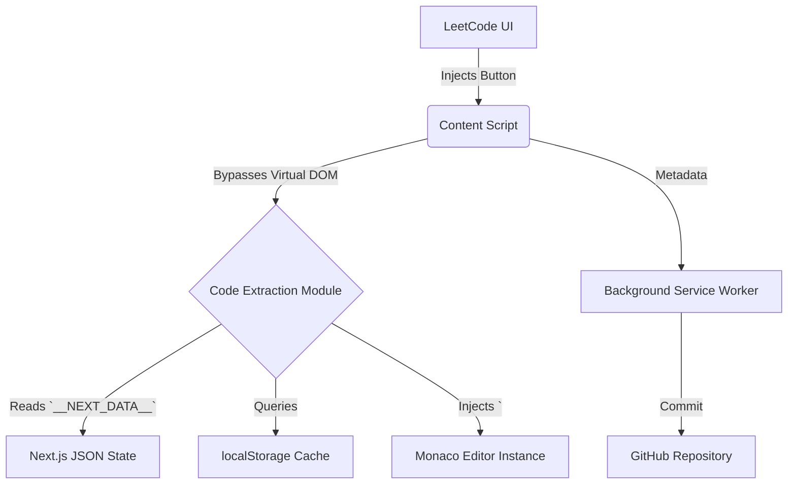

<div align="center">
  
</div>

<h1 align="center">Leet2Hub 🚀</h1>

<p align="center">
  <b>A powerful, fully-automated ecosystem designed to seamlessly sync your LeetCode progress to GitHub, augmented by next-generation AI explanations.</b>
</p>

<p align="center">
  
  
  
  
</p>

---

## 📖 Introduction

**Leet2Hub** bridges the gap between grinding Data Structures and Algorithms on LeetCode and building an impressive, professional GitHub portfolio. This robust Chrome Extension + API ecosystem completely eliminates the tedious process of copying, pasting, organizing, and formatting your code.

Every time you solve a problem, Leet2Hub automatically pushes your code, execution time, and memory metrics to your target GitHub repository. Even better, it uses the **Google Gemini API** to write a beautifully formatted Markdown `README.md` explaining your algorithm's Intuition, Approach, and Complexity Analysis!

---

## 🌟 Key Features

*   **🤖 AI-Generated Solutions:** Powered by the Google Gemini API! Leet2Hub reads your code and automatically generates a pristine Markdown `README.md` containing deep algorithmic insights for every problem you push.
*   **📂 DSA Folder Auto-Categorization:** Fetches problem tags via LeetCode's GraphQL API and automatically routes your code to specific topic folders (e.g., `01-Arrays-and-Hashing`, `09-Trees`).
*   **📦 Smart Packaging:** Creates a dedicated sub-folder for every problem containing both your source code and your AI-generated explanation.
*   **💅 Glassmorphism UI:** A sleek, modern configuration modal matching LeetCode's native golden-orange (`#ffa116`) aesthetic.
*   **⚡ One-Click Push:** Automatically push your solved problems from LeetCode to GitHub with a single click or keyboard shortcut.
*   **📈 Performance Metrics:** Your GitHub commit messages automatically include LeetCode Time and Memory performance stats (e.g., `[Time Beats: 98%]`).
*   **🛡️ Secure & Sandboxed:** Uses Chrome's `chrome.storage.local` to securely store your Personal Access Tokens and API keys entirely locally.

---

## 🏗️ System Architecture Workflow

Leet2Hub operates entirely on the client side without needing an intermediate server to sync your code to GitHub.



### Component Structure



---

## 🚀 Installation & Setup

1.  **Clone or Download**: Clone this repository to your local machine:
    ```bash
    git clone https://github.com/anuj-er/Leet2Hub.git
    ```
2.  **Load Unpacked Extension**: Open `chrome://extensions/` in Google Chrome, enable **Developer mode** in the top right corner, and click **Load unpacked**. Select the `Leet2Hub-Extension` directory.
3.  **Configure GitHub**: Pin the extension to your toolbar and open any LeetCode problem. The Leet2Hub configuration modal will appear.
4.  **Enter Credentials**: 
    *   **GitHub Repository URL**: Link to your target repository (e.g., `https://github.com/anuj-er/LeetCode-Solutions`).
    *   **Personal Access Token**: A Classic token with the `repo` scope.
5.  **Configure AI (Optional)**: Paste your **Google Gemini API Key** and toggle "Generate AI Explanation" to **yes**.
6.  **Push!**: Solve a problem on LeetCode, wait for the green "Accepted" text, and click the golden **Push** button (or press your configured shortcut).

---

## 🛠️ Project Ecosystem

This repository is split into two primary components:

### 1. `Leet2Hub-Extension`
The core Google Chrome Extension. It injects the frontend UI into LeetCode, securely stores user configurations, parses complex dynamic DOM nodes (Next.js state, Monaco editor models), and communicates with the GitHub API.

### 2. `Leet2Hub-api`
Supporting backend API services (if deployed) for handling complex OAuth flows, proxying requests to bypass strict CORS policies, or future analytics features.

---

## 👨‍💻 Author

Created and maintained by **[anuj-er](https://github.com/anuj-er)**.

If you find this extension helpful in your DSA journey, please consider giving the repository a ⭐!

## 🤝 Contributing
Contributions, issues, and feature requests are always welcome! Feel free to check the [issues page](https://github.com/anuj-er/Leet2Hub/issues).

## 📄 License
This project is open-source and licensed under the [MIT License](LICENSE).
