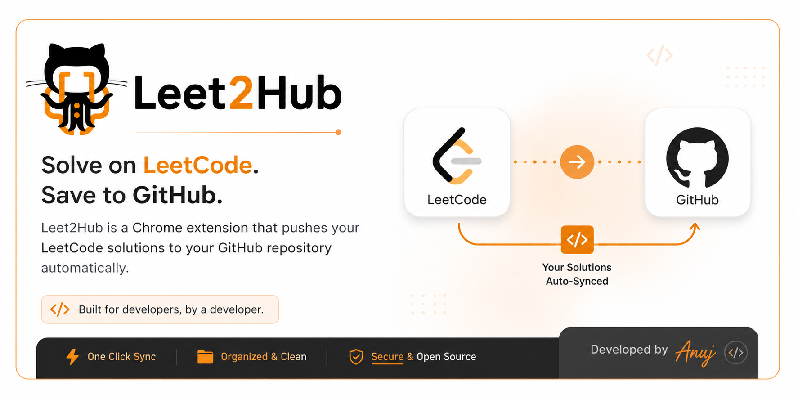
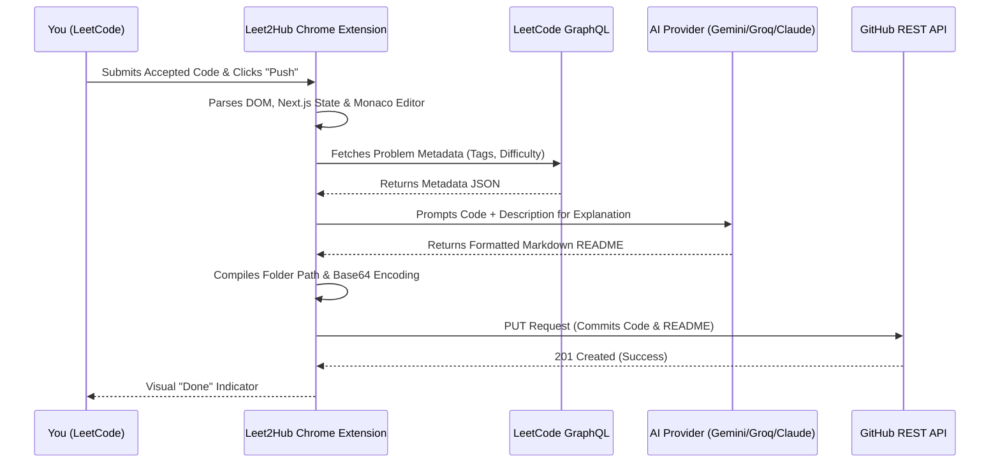
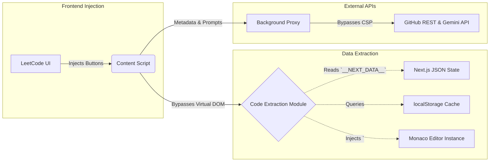
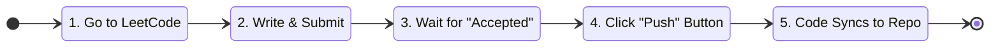

  

  <b>A fully-automated Chrome Extension designed to seamlessly sync your LeetCode progress to GitHub, augmented by next-generation AI explanations.</b>

  
  
  
  
  
  

---

## Introduction

**Leet2Hub** bridges the gap between solving Data Structures and Algorithms on LeetCode and building a professional GitHub portfolio. This Chrome Extension eliminates the manual process of copying, pasting, organizing, and formatting your code.

Upon solving a problem, Leet2Hub automatically pushes your code, execution time, and memory metrics to a designated GitHub repository. Furthermore, it integrates natively with multiple AI providers (**Google Gemini, Groq, and Anthropic**) to generate a comprehensive Markdown `README.md` that explains your algorithm's Intuition, Approach, and Complexity Analysis.

---

## Key Features

*   **AI-Generated Solutions (Multi-Provider):** Powered by your choice of **Google Gemini, Groq (Llama 3), or Anthropic (Claude 3.5)**. Leet2Hub processes your code and automatically generates a detailed Markdown `README.md` containing algorithmic insights for every problem you push.
*   **Interactive Dashboard:** A modern popup dashboard to track your Daily Streak, Total Problems Solved, Difficulty Breakdown, and the active Daily Challenge.
*   **DSA Folder Auto-Categorization:** Fetches problem tags via LeetCode's GraphQL API and automatically routes your code to specific topic directories (e.g., `01-Arrays-and-Hashing`, `09-Trees`).
*   **Smart Packaging:** Creates a dedicated sub-directory for every problem containing both your source code and the AI-generated explanation.
*   **Glassmorphism UI:** A sleek configuration modal designed to match LeetCode's native aesthetic.
*   **One-Click Push:** Automatically push your solved problems from LeetCode to GitHub with a single click.
*   **Performance Metrics:** GitHub commit messages automatically include LeetCode Time and Memory performance statistics (e.g., `[Time Beats: 98%]`).
*   **Secure & Sandboxed:** Utilizes Chrome's `chrome.storage.local` to securely store your Personal Access Tokens and API keys entirely locally.
*   **Customizable UI Preferences:** Toggle off Premium Icons directly from the Leet2Hub settings for a cleaner LeetCode interface.

---

## System Architecture Workflow

Leet2Hub operates entirely on the client side without requiring an intermediate server to synchronize your code to GitHub.

```mermaid
sequenceDiagram
    participant User as You (LeetCode)
    participant L2H as Leet2Hub Chrome Extension
    participant LC as LeetCode GraphQL
    participant Gemini as AI Provider (Gemini/Groq/Claude)
    participant GH as GitHub REST API

    User->>L2H: Submits Accepted Code & Clicks "Push"
    L2H->>L2H: Parses DOM, Next.js State & Monaco Editor
    L2H->>LC: Fetches Problem Metadata (Tags, Difficulty)
    LC-->>L2H: Returns Metadata JSON
    L2H->>Gemini: Prompts Code + Description for Explanation
    Gemini-->>L2H: Returns Formatted Markdown README
    L2H->>L2H: Compiles Folder Path & Base64 Encoding
    L2H->>GH: PUT Request (Commits Code & README)
    GH-->>L2H: 201 Created (Success)
    L2H-->>User: Visual "Done" Indicator
```

 

### Component Structure

```mermaid
graph LR
    subgraph Frontend Injection
        A[LeetCode UI] -->|Injects Buttons| B(Content Script)
    end
    
    subgraph Data Extraction
        B -->|Bypasses Virtual DOM| C{Code Extraction Module}
        C -.->|Reads `__NEXT_DATA__`| D[Next.js JSON State]
        C -.->|Queries| E[localStorage Cache]
        C -.->|Injects `<script>`| F[Monaco Editor Instance]
    end
    
    subgraph External APIs
        B -->|Metadata & Prompts| G[Background Proxy]
        G -->|Bypasses CSP| H[GitHub REST & Gemini API]
    end
```

---

## Installation & Setup

1.  **Clone or Download**: Download this repository and extract the ZIP file.
2.  **Load Unpacked Extension**: Open `chrome://extensions/` in Google Chrome, enable **Developer mode** in the top right, and click **Load unpacked**. Select the `Leet2Hub-Extension/dist` directory (or build the project yourself using `npm run build` in the popup directory).
3.  **Launch Dashboard**: Pin the extension to your toolbar. Click the extension icon to view the Leet2Hub Dashboard.
4.  **Configure GitHub**: Click the **Configure GitHub Integration** button in the dashboard, or open any LeetCode problem. The Leet2Hub configuration modal will appear.
5.  **Enter Credentials**: 
    *   **GitHub Repository URL**: Link to your target repository (e.g., `https://github.com/anuj-er/LeetCode-Solutions`).
    *   **Personal Access Token**: A Classic token with the `repo` scope.
6.  **Configure AI (Optional)**: Choose your preferred AI provider (Gemini, Groq, or Anthropic), provide the respective API Key, and toggle "Generate AI Explanation" to **yes**.

---

## Usage Guide

Using Leet2Hub is designed to be frictionless. Follow this workflow for the best experience:

```mermaid
stateDiagram-v2
    direction LR
    [*] --> 1
    1: 1. Go to LeetCode
    1 --> 2
    2: 2. Write & Submit
    2 --> 3
    3: 3. Wait for "Accepted"
    3 --> 4
    4: 4. Click "Push" Button
    4 --> 5
    5: 5. Code Syncs to Repo
    5 --> [*]
```

### 1. Solve and Submit
Navigate to any LeetCode problem. Write your solution and click the green **Submit** button on LeetCode. **Important:** You must submit your code and receive an "Accepted" verdict first.

### 2. Click the Push Button
Once your solution is accepted, locate the LeetCode action bar (where the Submit button resides). Leet2Hub injects a custom **Push** button adjacent to it. 
> *Note: If the Push button is not visible, ensure you have fully configured your GitHub repository in the extension settings.*

### 3. Verify on GitHub
A small notification will appear on the Push button indicating "Pushing...", which will eventually transition into a green checkmark indicating success. Check your GitHub repository to see your code formatted in its own directory, complete with an AI-generated `README.md` if the Gemini integration was enabled.

---

## Project Ecosystem

This repository is split into two primary components:

### 1. `Leet2Hub-Extension`
The core Google Chrome Extension. It injects the frontend UI into LeetCode, securely stores user configurations, parses complex dynamic DOM nodes (Next.js state, Monaco editor models), and communicates with the GitHub API. The popup dashboard is built with React, Tailwind CSS, and Vite.

### 2. `Leet2Hub-api`
Supporting backend API services (if deployed) for handling complex OAuth flows, proxying requests to bypass strict CORS policies, or future analytics features.

---

## Author

Created and maintained by **[anuj-er](https://github.com/anuj-er)**.

If you find this extension helpful, please consider giving the repository a star.

## Contributing
Contributions, issues, and feature requests are welcome. Feel free to check the [issues page](https://github.com/anuj-er/Leet2Hub/issues).

## License
This project is open-source and licensed under the [MIT License](LICENSE).
